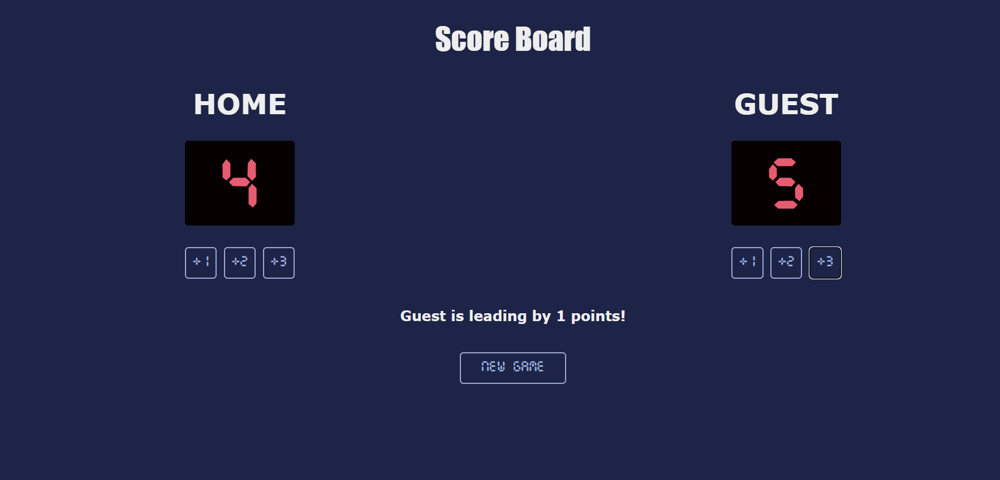

# Scoreboard App

A dynamic scoreboard app to track scores between two teams: Home and Guest. The app allows incrementing scores by 1, 2, or 3 points, indicates which team is leading, and provides a reset functionality to start a new game.



## Features

- Display scores for Home and Guest teams
- Increment scores by 1, 2, or 3 points for each team
- Indicate which team is leading
- Reset scores to start a new game

## Installation

To get a local copy up and running, follow these simple steps:

1. Clone the repository:
    ```sh
    git clone https://github.com/jaiswalism/js-scoreboard.git
    ```
2. Navigate to the project directory:
    ```sh
    cd scoreboard-app
    ```

## Usage

1. Open the `index.html` file in your web browser:
    ```sh
    open index.html
    ```
2. Use the buttons to increment the scores for each team:
   - "Home +1" to add 1 point to the Home team
   - "Home +2" to add 2 points to the Home team
   - "Home +3" to add 3 points to the Home team
   - "Guest +1" to add 1 point to the Guest team
   - "Guest +2" to add 2 points to the Guest team
   - "Guest +3" to add 3 points to the Guest team
3. The app will dynamically update to show which team is leading.
4. Click the "New Game" button to reset all scores and start a new game.

## Contributing

Contributions are what make the open source community such an amazing place to learn, inspire, and create. Any contributions you make are **greatly appreciated**.

1. Fork the Project
2. Create your Feature Branch (`git checkout -b feature/AmazingFeature`)
3. Commit your Changes (`git commit -m 'Add some AmazingFeature'`)
4. Push to the Branch (`git push origin feature/AmazingFeature`)
5. Open a Pull Request

## License

Distributed under the MIT License. See `LICENSE` for more information.
